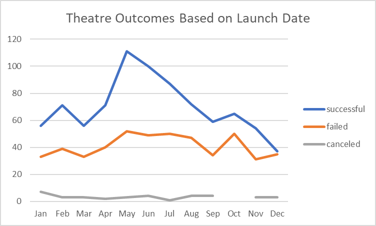
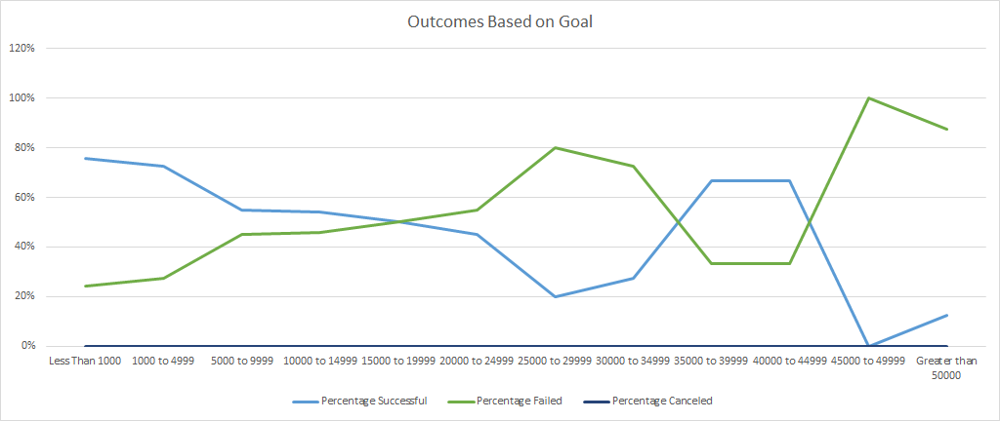
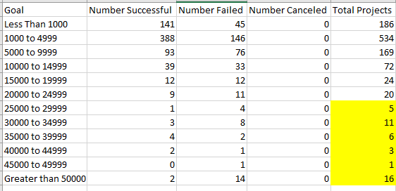

# Kickstarting with Excel

## Overview of Project - 

### Purpose

- The purpose of this analysis was to provide Louise with information on how to best fund her play *Fever* using a crowdfunding campaign.  We used data analysis to analyze and visualize data from Kickstarter in order to examine the outcomes of different campaigns, and how the campaign's fared in relation to their launch dates and their funding goals. 

## 2. Analysis and Challenges

### The "How" 

- "How" I performed my analysis was by using data from Kickstarter in combination with Excel to create charts to visualize the data to determine trends. I used various Excel code to conduct the data analysis. Some of the code I used included were "CountIfs" statements and Pivot Tables.

### Challenges

- Challenges I overcame was the complex coding of "CountIfs" statements. It was a difficult to come up with the correct code to account for three different conditional statements: goal amount, outcomes, and subcategory.

## Results

### Conclusions

- There are two conclusions I can draw from the relationship between theater outcomes as their launch date. First, the campaigns that occurred in the middle of the year had the highest number of successful outcomes. Second, the campaigns that occurred at the end of the year had the least amount of successful outcomes, and the highest number of failed outcomes. So it is best to start the crowdfunding campaign in the middle of the year and not at the end of the year. 

 

- Additionally, as far as the relationship between theater outcomes and their funding goal amount, I can conclude that a successful theatre outcome occurred most often when the goal amount to be raised was $4,999 or less.

 

### Limitations

- There were some limitations in the dataset. One limitation is the sample size. For campaigns with goals over $25,000, there were only 42 projects in the sample set. That may not be enough of a sample size for the results to be statistically significant. 

- A second limitation, are the categories. Some campaigns may have been mistakenly categorized as belonging to the "theatre" category which would throw off the analysis.

### Additional Analysis

- Other Tables and Graphs I can create include a graph of the outcomes based on duration of campaign. Maybe it is not the start date of a campaign that best determines the outcome of campaign as it is the duration, but rather the length of the campaign.
